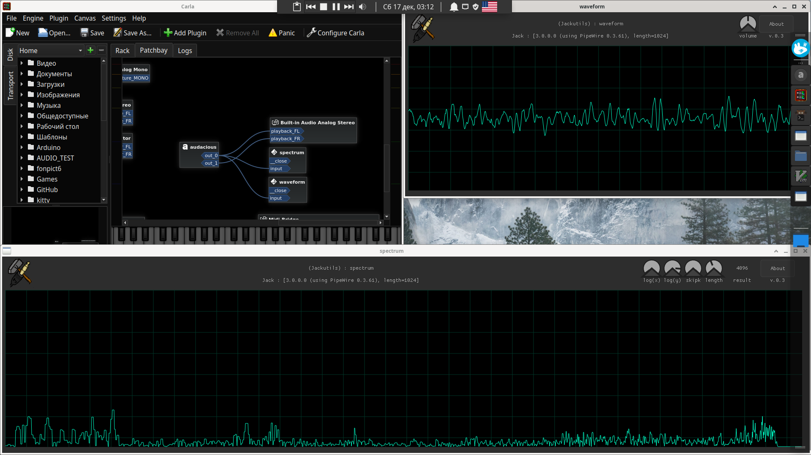

## About JackUtils
# jackutils - what is this?
Jackutils is a library and a set of useful utilities for the JACK. The library implements a simple api for managing connected ports using descriptors, connecting and checking whether the jack server is working, opening a glfw window and primitive drawing functions (for visualizations, optional)

## List of utilites

# Some simple utilities
**TODO**
# Generator
*(audio data generation utility)*
increased during time waveform generator. (this feature can be disabled).   
flags : ```sh
-h         to see help
-v         to see version
-a [value] to set volume of output signal [0 .. 1.0]
-f [value] to set frequency
-s [value] to set step of frequency per sample (set to 0 to disable)
```
# Volumer
*(audio data transformation utility)*
changes volume of audio data (distorsion is possible)
flags : ```sh
-h         to see help
-v         to see version
-a [value] to set volume of output signal [0 .. 1.0+ (max is 10.0, but it makes distorsion)]
```
# NormVol
*(audio data transformation utility)*
*(changes volume of audio data dynamicly until it not distorsies)*
flags : ```sh
-h         to see help
-v         to see version
-k [value] to set volume grow coefficient during processing one block of data [0.001 .. 0.5] (don't set it too large)
```
# Waveform
*(visualization utility)*    

# Spectrum
*(visualization utility)*    

flags : ```sh
-h         to show help
-v         to show version
-m [value] to set visualization mode [0..3] (default, x:log, [x,y]:log, y:log)
-w [value] to set window [0..3] (rectangle, gausse, hamming, hann) 
```
controls : ```sh
    LMB hold and move -  move camera position
    Mouse whell scroll - change camesa scale
    +/- buttons -        change spectrum width scale
    button 1    -        change mode
    button 2    -        change window
```
# real TODO and contributing
- Include nuklear library!
- Move utilities documentation to separate file!
- C++ is a bullshit! Never tell me to rewrite codebase on C++ or i will take your soul. 
- Any ideas for additional utilities?
- Usage of ports at this moment is **TOTALLY NOT THREADSAFE** and thats a problem. Any ideas how to lock them threadsafely and fast please.
- I need more tests in real problems, not for my toy needs. If you have any ideas and suggestions, write to Suggestions
- Check is this readme is lexically correct. I hate google translator :D
