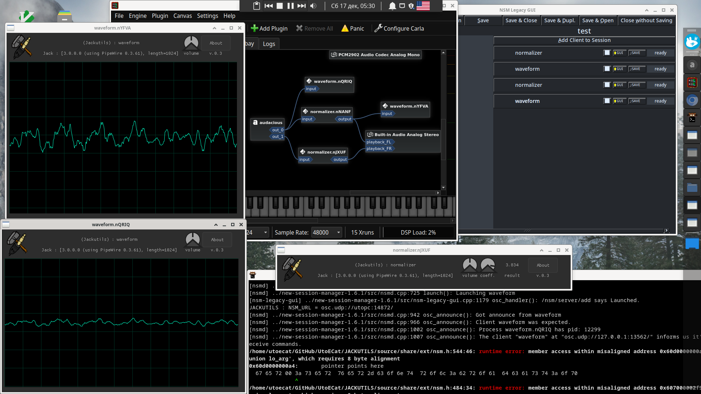

# About JackUtils
## jackutils - what is this?
Jackutils is a library and a set of useful utilities for the JACK. The library implements a simple api for managing connected ports using descriptors, connecting and checking whether the jack server is working, setuping and estabilishing connection with session manager, opening a glfw window and gui(powered by nuklear). 

# Contributing and source code
is available at [GitHub](https://github.com/UtoECat/jack_utils).
File README.md contains TODO list of known issues and required work you may help with :)
# Documentation sections
## JackUtils
- @ref jackutils
- @ref jackutilsctx
- @ref jackutilsport
- @ref jackutilsbuff
## Jackutils Extensions
- @ref jackgui
- @ref customwidgets
## Examples
nothing here yet

